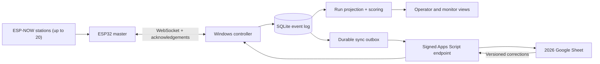

# Architecture

The Windows controller is the source of truth during an event. It records every
accepted event in SQLite before updating derived state or attempting Google sync.

## Invariants

- Only one run is active.
- Raw device events are immutable. Undo creates a void event and corrections create
  correction events.
- An event ID is processed at most once, even when messages are retried.
- Google latency never blocks station input.
- A controller restart marks an active run interrupted. The evidence remains, but
  the competitor begins a new run.
- A master or station reboot creates a new boot ID. Sequence numbers are meaningful
  only within that boot session.

## Repository layout

- `src/`: controller, state projection, and scoring policies
- `firmware/`: PlatformIO master and station variants
- `google-apps-script/`: the narrow synchronization and emergency-mode script
- `config/`: versioned season definitions and schema
- `tests/` and `simulator/`: deterministic scoring and reliability checks
- `docs/`: protocol, setup, security, operations, and validation

